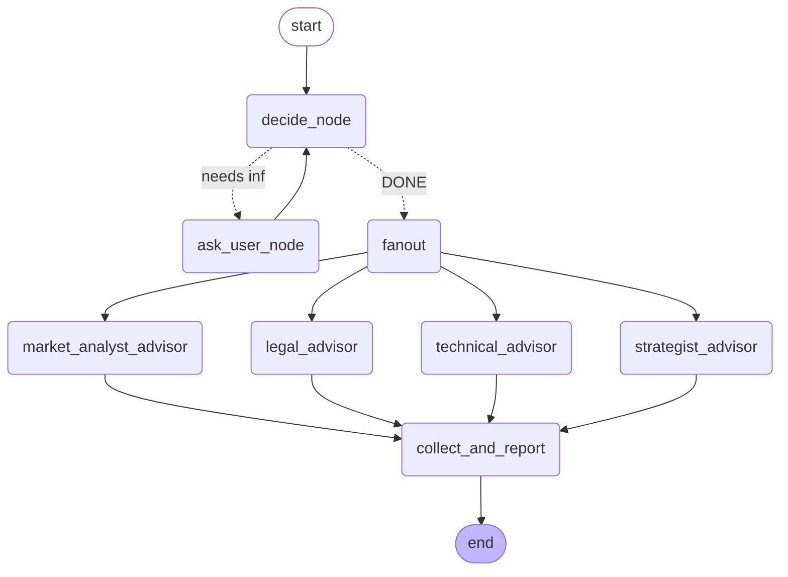

# Business Idea Evaluator

A **human-in-the-loop, parallelized multi-agent system** that helps founders evaluate a startup idea from four professional perspectives at once — built with [LangGraph](https://langchain-ai.github.io/langgraph/).

Instead of taking an idea at face value, the system first **asks clarifying questions** until it has enough context, then **fans out to four specialized AI advisors running in parallel**, and finally **consolidates their reports** into one structured evaluation.


---

## What it does

1. **Clarification loop (human-in-the-loop).** A *decider* node inspects the conversation and either asks **one** precise follow-up question or signals `DONE`. The founder's answers are fed back in until the idea is well defined.
2. **Parallel advisors.** Once enough context is gathered, the graph fans out to four independent advisors that run **simultaneously**:
   -  **Market Analyst** — market sizing, competitors, target segments, timing
   -  **Legal Advisor** — IP, licensing, compliance (e.g. GDPR), contracts
   -  **Technical Advisor** — feasibility, tech stack, scalability, cost/risk
   -  **Strategist Advisor** — launch milestones, positioning, early traction
3. **Consolidation.** A *collect & report* node merges the four reports into a single, structured evaluation for the founder.

## Concepts demonstrated

| Concept | Where it shows up |
| --- | --- |
| **Human-in-the-loop** | `decide_node` → `ask_user_node` clarification loop |
| **Parallelization** | `fanout` hub branches to 4 advisors that execute concurrently |
| **State merging** | `add_messages` (append) + `operator.or_` (merge dicts) in `State` |
| **Conditional routing** | `route()` chooses between asking again or fanning out |
| **Map-reduce style aggregation** | `collect_and_report` waits for all advisors, then reduces |

##  Architecture



## Project structure

```
business-idea-evaluator/
├── src/business_idea_evaluator/
│   ├── __init__.py
│   ├── __main__.py        # python -m business_idea_evaluator
│   ├── main.py            # CLI entry point
│   ├── state.py           # Graph state (TypedDict + reducers)
│   ├── llm.py             # LLM factory, loads key from .env
│   ├── advisors.py        # The four advisor nodes
│   └── graph.py           # Nodes, routing, and graph wiring
├── notebooks/             # Original step-by-step notebook
├── requirements.txt
├── pyproject.toml
├── .env.example
└── README.md
```

##  Getting started

### 1. Clone and install

```bash
git clone https://github.com/<your-username>/business-idea-evaluator.git
cd business-idea-evaluator
python -m venv .venv && source .venv/bin/activate   # Windows: .venv\Scripts\activate
pip install -r requirements.txt
```

### 2. Add your API key

```bash
cp .env.example .env
# open .env and set OPENAI_API_KEY=sk-...
```

### 3. Run

```bash
python -m business_idea_evaluator
```

Example session:

```
What is your business idea?
You: I want to sell handmade bamboo toothbrushes.

Assistant: Who is your primary target customer, and through which channels do you plan to sell?
You: Eco-conscious millennials, sold online via my own store and Instagram.

... (four advisors run in parallel) ...

============================================================
FINAL REPORT
============================================================
[consolidated, structured evaluation]
```

##  Configuration

Set these in `.env` (all optional except the key):

| Variable | Default | Description |
| --- | --- | --- |
| `OPENAI_API_KEY` | — | **Required.** Your OpenAI API key. |
| `MODEL_NAME` | `gpt-4o` | Chat model to use. |
| `TEMPERATURE` | `0` | Sampling temperature. |

##  Possible extensions

- Trace and evaluate runs with **LangSmith**.
- Add or swap advisor roles ( Finance, UX, Go-to-Market).
- Build a **meta-advisor** that dynamically generates advisor roles based on the idea.
- Wrap the graph in a **Streamlit / FastAPI** interface instead of the CLI.

##  License

MIT — see [LICENSE](LICENSE).

---
